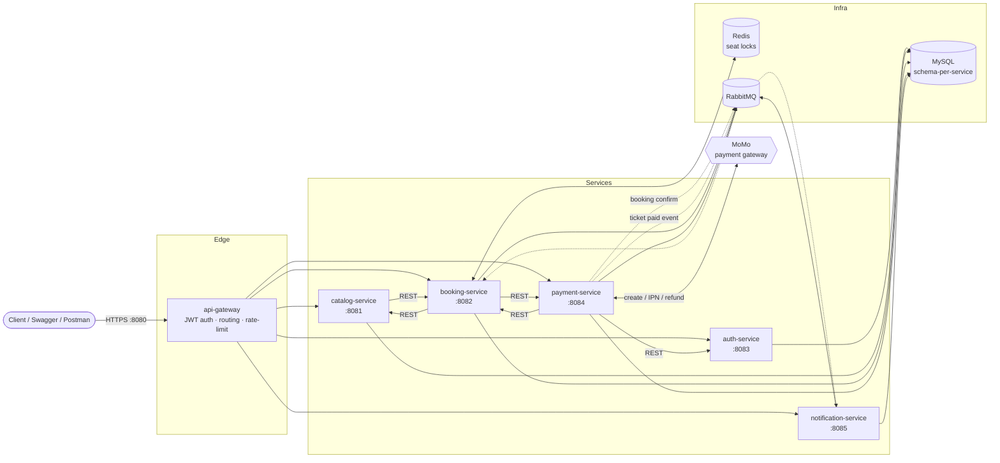

# Movie Ticket Booking Platform — Microservices

A production-style backend for an online cinema ticketing system, built as **6 independent Spring Boot services** behind an API gateway, with real payment integration, concurrency-safe seat holding, and resilience patterns.

> **Status:** Core booking flow complete (Phase 1: 39/40). Currently hardening for deployment — see [Roadmap](#roadmap).

[](https://github.com/QuyenNDD/movie_ticket_microservice/actions/workflows/ci.yml)

---

## Architecture



Every internal REST call (path `/api/v1/**`) is wrapped in a **Resilience4j circuit breaker + retry** with connect/read timeouts; a down dependency fails fast as HTTP 503 instead of hanging.

---

## Tech stack

| Area | Choice |
|---|---|
| Language / framework | Java 21, Spring Boot 3.5, Spring Cloud Gateway |
| Data | MySQL 8 (one schema per service), Spring Data JPA |
| Cache / locking | Redis (seat-hold TTL locks) |
| Messaging | RabbitMQ (payment ⇄ booking confirm, paid-ticket events) |
| Auth | JWT access + refresh tokens, BCrypt, gateway-centralised verification |
| Payments | MoMo (create QR, IPN signature verification, auto-refund) |
| Resilience | Resilience4j (circuit breaker, retry), client timeouts |
| Observability | Spring Boot Actuator (`/actuator/health` with liveness/readiness probes) |
| API docs | springdoc-openapi (Swagger UI per service) |
| Tests | JUnit 5 + Mockito (service-layer unit tests) |
| Delivery | Multi-stage Docker builds, Docker Compose full stack |

---

## Key technical highlights

- **Concurrency-safe seat selection** — temporary holds via `SET NX` Redis locks with TTL; DB check for already-paid seats; rejects isolated single-seat gaps; couple seats counted as 2 logical seats; per-order seat cap.
- **Real payment integration** — MoMo create-payment + HMAC-signed IPN callback with replay protection and idempotent confirmation; automatic MoMo refund on cancellation of a paid booking (idempotent, with `PENDING`/`FAILED`/`COMPLETED` refund states).
- **Async confirmation with retry** — payment→booking confirmation flows over RabbitMQ; a `PaymentConfirmRetryJob` re-drives stuck confirmations with backoff, escalating to `PAYMENT_REVIEW` after N attempts.
- **E-tickets** — one QR ticket generated per seat on first successful payment; staff check-in endpoint (ADMIN-only at the gateway) blocks double check-in and tickets from cancelled bookings.
- **Defence in depth** — gateway verifies JWT and injects trusted `X-User-Id`/`X-User-Role` headers (stripping client-supplied ones); each service also guards its own endpoints with a gateway secret / internal secret (constant-time compared).

---

## Running the whole system

**Prerequisites:** Docker + Docker Compose. ~4 GB RAM free.

```bash
cp .env.example .env      # fill in secrets (MoMo sandbox, Cloudinary, Gmail app password, random secrets)
docker compose up -d --build
```

First build downloads Maven dependencies per service (~a few minutes). Once healthy:

| Endpoint | URL |
|---|---|
| API gateway | http://localhost:8080 |
| Gateway health | http://localhost:8080/actuator/health |
| RabbitMQ management | http://localhost:15672 (guest / guest) |

Swagger UI is served by each service on its own port (see `docker-compose.yml`); expose a port under `ports:` to browse it, e.g. `catalog-service` → http://localhost:8081/swagger-ui.html.

Stop: `docker compose down` (add `-v` to wipe the MySQL volume).

### Running a single service outside Docker

Needs JDK 21. Start MySQL/Redis/RabbitMQ (e.g. `docker compose up -d mysql redis rabbitmq`), create the databases, export that service's env vars, then `./mvnw spring-boot:run` in its directory. Ports: gateway 8080, catalog 8081, booking 8082, auth 8083, payment 8084, notification 8085.

---

## Tests

```bash
cd booking-service && ./mvnw test     # 21 unit tests (Mockito, no infra needed)
cd payment-service && ./mvnw test     # 14 unit tests
```

All 6 services build green. The default `@SpringBootTest contextLoads` in each is `@Disabled` (needs live infra); business logic is covered by fast Mockito unit tests on `BookingServiceImpl` and `MomoServiceImpl` — the money- and concurrency-critical code.

---

## Repository layout

```
api-gateway/           Spring Cloud Gateway — routing, JWT auth filter, rate limiting, CORS
auth-service/          register / login / refresh / logout, password reset, email verification
catalog-service/       movies, cinemas, rooms + seat maps, showtimes, snacks, combos, reviews, favorites
booking-service/       seat holds, payment confirm/cancel, refunds, e-tickets, check-in, reminders
payment-service/       MoMo create / IPN / refund, transaction history, confirm-retry job
notification-service/  in-app notifications + transactional email (RabbitMQ consumer)
docker/mysql/init.sql  creates one database per service
docker-compose.yml     full stack: 6 services + MySQL + Redis + RabbitMQ
FEATURE_CHECKLIST.md   feature-by-feature status across 5 phases
```

---

## Roadmap

**Now — deployment hardening**
- [x] Unit tests for the critical service logic
- [x] Swagger / OpenAPI per service
- [x] Actuator health checks + probes
- [x] Resilience4j circuit breaker / retry / timeout on internal calls
- [x] Dockerfiles + full-stack Docker Compose
- [ ] CI (GitHub Actions: build + test)
- [ ] Deploy to a public host (reverse proxy + HTTPS)
- [ ] Postman collection for the end-to-end booking flow

**Next — business features (Phase 2 / 3)**
- [ ] Vouchers / discount codes
- [ ] Revenue & occupancy dashboard
- [ ] Cinema-staff role-based access

Full detail in [`FEATURE_CHECKLIST.md`](FEATURE_CHECKLIST.md).
